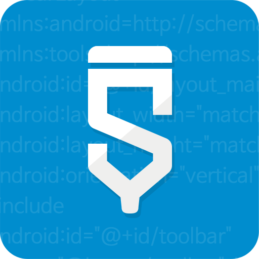

Sketchware Project

Welcome to our Sketchware project! This repository contains Components,Blocks,Events and sketchware mod

Getting Started
To get started with this project, you'll need to download and install Sketchware and Blocks for Sketchware.

Download Updated Sketchware mod: https://www.mediafire.com/file/80167axzmu442lg

Download Updated Blocks for Sketchware
https://www.mediafire.com/file/w6nf9rlyhq6rkwl
palette : https://www.mediafire.com/file/37rm6q8y0bas73z

Files location on storage/emulated/0
block.json and palette location: .sketchware/resources/block/My Block
component.json,events.json,listeners.json: .sketchware/resources/block/My Block/System

What's New
I've recently fixed the AppCompat bug by adding more files to the META-INF folder in the mod. This should resolve any issues related to AppCompat.

Footage
Here are some footage of our project:

Contributing
If you'd like to contribute to this project, please fork the repository and submit a pull request.

Issues
If you encounter any issues or have questions, please open an issue in this repository.

Let me know if you need any further changes!
